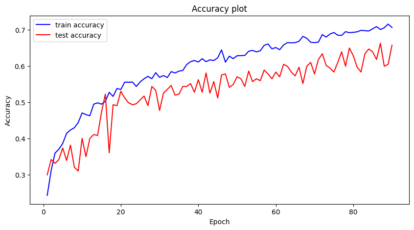
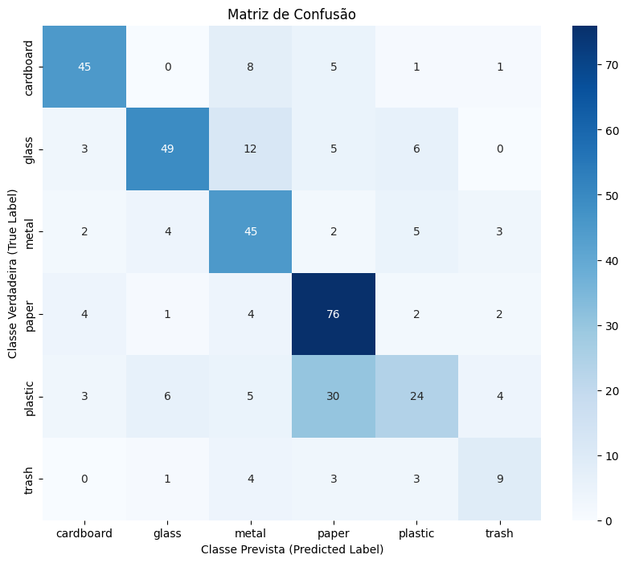

# 🧠 Classificação de Imagens com CNN e Data Augmentation

Este repositório contém um experimento utilizando **Redes Neurais Convolucionais (CNN)** para classificação de imagens.
O objetivo principal é analisar como diferentes estratégias de **Data Augmentation** afetam o desempenho do modelo, com foco em métricas como acurácia e matriz de confusão.

---

## 📂 Estrutura do Repositório

| Arquivo / Pasta | Descrição                                                                                                                                |
| --------------- | ------------------------------------------------------------------------------------------------------------------------------------------ |
| `FIA_TP2.ipynb` | Notebook contendo o código completo do projeto, incluindo pré-processamento, definição do modelo, treinamento, avaliação e análise. |
| `README.md`     | Documento com o contexto, metodologia e resultados finais do projeto.                                                                      |

---

## 🎯 Objetivo

Treinar um modelo de deep learning para classificação de imagens utilizando técnicas de aumento de dados (data augmentation), avaliando:

- Generalização do modelo
- Redução de overfitting
- Impacto nas métricas finais de desempenho

---

## 🧪 Metodologia

O projeto utiliza a seguinte pipeline:

1. **Carregamento e organização do dataset**
2. **Data Augmentation** com transformações como:
   - Rotação
   - Flip horizontal
   - Zoom
   - Mudança de brilho
   - Shear
3. **Treinamento de uma CNN** com:
   - Callbacks (Early Stopping, Reduce LR on Plateau e ModelCheckpoint)
   - Split entre treino e validação
4. **Avaliação do modelo**, incluindo matriz de confusão e acurácia.
5. **Discussão dos resultados**.

---

📊 Resultados

O modelo atingiu um desempenho satisfatório considerando a complexidade do dataset.

* **Acurácia final:** 71% (0.71)

#### Histórico de Treinamento (Acurácia e Loss)

*O gráfico demonstra a estabilidade do treinamento e a redução do overfitting graças ao Data Augmentation.*

#### Matriz de Confusão

*A matriz indica que o modelo tem excelente desempenho em Papel e Papelão, com melhorias significativas na detecção de Plástico e Lixo orgânico na versão final.*

---

## 🧠 Análise da Generalização e Erros

- Classes mais confundidas:

  > Lixo Orgânico (trash): Esta foi a classe com o desempenho mais baixo (recall de $\approx 40\%$). O modelo teve dificuldade em identificar corretamente os itens desta categoria.
  > Plástico (plastic): Foi a segunda classe mais difícil, com um recall de $\approx 57\%$.
  
- Possíveis causas:

  - Semelhança visual entre classes: A principal confusão provavelmente ocorre entre plastic e glass (vidro), já que ambos podem ser transparentes e ter formatos de garrafa, tornando-os difíceis de distinguir para a CNN.
  - Dataset desbalanceado: A classe trash é a menor de todo o dataset. Mesmo com o uso de class_weight (que ajudou muito), o modelo ainda teve menos exemplos para aprender os padrões dessa classe, o que explica seu baixo recall.
  - Limitações da arquitetura: Embora o modelo tenha atingido 71%, ele ainda é uma CNN personalizada. Classes muito complexas ou com poucas amostras podem exigir arquiteturas mais profundas (como as de Transfer Learning) para uma classificação perfeita.

---

## 🏁 Conclusão

Com base nas análises, o uso de **data augmentation** teve impacto relevante no modelo, auxiliando na redução de overfitting e melhorando a capacidade de generalização.
Comparando os resultados com e sem augmentation, observa-se que o modelo com augmentations:

✔ Treina de maneira mais estável
✔ Generaliza melhor em dados nunca vistos
✔ Reduz discrepâncias entre loss/accuracy de treino e validação

A implementação e experimentação demonstram a importância dessas técnicas quando se trabalha com datasets limitados ou desbalanceados.

---

## 📌 Tecnologias Utilizadas

- Python
- TensorFlow / Keras
- NumPy / Pandas
- Matplotlib
- Jupyter Notebook

## Alunos

- Yago Lobato
- Nathã Barbosa
- Matheus Santarém
- Emanuel Andriola
- Daniel Trindade
- Cristiano Cardoso

### E-mails

- yagobrlobato@icomp.ufam.edu.br
- NathaBarbosa@icomp.ufam.edu.br
- matheus.santarem@icomp.ufam.edu.br
- Emanuel.moraes@icomp.ufam.edu.br
- daniel.trindade@icomp.ufam.edu.br
- cristiano.lima@icomp.ufam.edu.br

---
